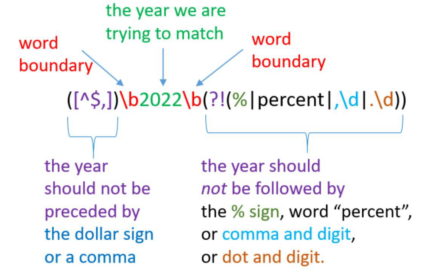
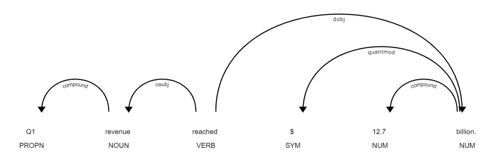

在第7章和第8章中，我们讨论了在词的层面上的不同的文本分析措施（例如，语气、可读性）。然而，在句子层面上分析文本文件往往是有用的，特别是当我们想保留句子结构、词的依赖性和时间依赖性时。在本章中，我们将讨论处理句子的基本技术。我们首先解释了如何将句子分类为前瞻性的。然后我们讨论了基于字典的确定句子主题的技术。最后，我们回顾了识别句子主语和宾语以及确定句子命名实体的技术。

# 9.1 识别前瞻性的句子

公司信息披露中的前瞻性声明（FLS）传达了有关预期事件、趋势以及管理层的战略和计划的信息，这些信息可能会影响公司的运营和经济环境。由于前瞻性信息披露对投资者很重要，《1995年私人证券诉讼改革法案》为此类信息披露引入了安全港条款，促进了前瞻性信息的披露。为了减少与前瞻性信息相关的潜在诉讼费用，所有公司都在其前瞻性信息中加入了法律免责声明，说明前瞻性信息不是对未来业绩的保证，不同的风险和不确定性可能导致公司的实际业绩与管理层的预期有很大的差异。

为了识别前瞻性声明，我们将使用Muslu等人（2015）开发的方法。具体来说，Muslu等人（2015）将一个句子归类为前瞻性声明，如果它包括以下内容之一。

- 对未来的提及。*will, future, next fiscal, next month, next period, next quarter, next year, incoming fiscal, incoming month, incoming period, incoming quarter, incoming year, coming fiscal, coming month, coming period, coming quarter, coming year, upcoming fiscal, upcoming month, upcoming period, upcoming quarter, upcoming year, subsequent fiscal, subsequent month, subsequent period, subsequent quarter, subsequent year, following fiscal, following month, following period, following quarter, and following year*
- 指向未来的动词和它们的变体。 *aim, anticipate, assume, commit, estimate, expect, forecast, foresee, hope, intend, plan, project, seek, target*
- 指的是申报年份之后的年份。例如，如果申报的财政年度（filing’s fiscal year ）是2020年，则为2022年。

因此，为了自动找到前瞻性声明，我们需要编写一段代码，测试三个FLS条件中是否至少有一个是真的。我们将按照Muslu等人（2015）的附录 "识别前瞻性披露"，首先生成对应于面向未来的术语的正则表达式。为了便于阐述代码，我们在每一行都加入了用于解释的注释。

输入

```python
import re

# To identify FLS, we need a dictionary file that 
# includes future-oriented verbs and their 
# conjugations as well as terms that identify 
# references to the future. In our case, this 
# file is "fls_terms.txt."

# file path (location) to a text file with FLS 
# terms (dictionary structure: one term per line)
fls_terms_file = r".\dictionaries\fls_terms.txt" 

# next, create a list of regex expressions that 
# match FLS terms
def create_fls_regex_list(fls_terms_file:str):
    """Creates a list of regex expressions of 
    FLS terms"""
    
    # opens the specified dict_file in "r" (read) mode
    with open(fls_terms_file,"r") as file: 
        # reads the content of the file line-by-line 
        # and creates a list of FLS terms
        fls_terms = file.read().splitlines() 
        
    # creates a list of FLS regex expressions by adding 
    # word boundary (\b) anchors to the beginning and 
    # the ending of each FLS term
    fls_terms_regex = [re.compile(r'\b' + term + r'\b') for term in fls_terms] 
    return fls_terms_regex 

# creates a list of FLS regex expressions 
fls_terms_regex = create_fls_regex_list(fls_terms_file) 
print(fls_terms_regex[0:3]) 
```

输出

```
[re.compile('\\bwill\\b'), re.compile('\\bfuture\\b'), re.compile('\\bnext fiscal\\b')]
```

除了检查一个句子是否包含其中一个前瞻性术语外，我们还需要检查它是否包含对未来年份的提及。请注意，为了识别文本中的年份，我们必须指定年份不能是一个（更大的）数字的一部分（如2020123），或者前面有一个美元符号（$）（如\$2020），或者后面有一个百分比符号（%）或单词"percent"。我们可以使用下面的重码\\z\正则表达式来搜索一个特定的年份参考。



```python
def is_forward_looking(sentence:str, year:int):
    """Returns whether sentence is forward-looking."""
    
    #creates a list of regex expression that match up 
    # to 10 years into the future
    future_year_terms=[re.compile(r"[^$,]\b" + 
                                  str(y) +
                                  r"\b(?!(%|,\d|.\d))") 
                       for y in range(year+1,year+10)] 
    
    # combines FLS regex expressions, i.e., regular 
    # expressions for FLS terms and future years
    fls_terms_with_future_years = fls_terms_regex + future_year_terms 
    
    for fls_term in fls_terms_with_future_years: 
        #fls_term.search(sentence) returns a match object 
        # if there is a match, and "None" if there is no 
        # FLS term match in the sentence
        if fls_term.search(sentence): 
            return True 
    return False
    
#Input text - excerpt from Apple's Q4 2018 
# Earnings Conference Call Transcript    
text = """Finally, we launched a completely new website 
experience for Atlanta. The new online experience 
provides a modern and fresh brand look and includes 
enhanced simplicity and flexibility for shopping and 
buying that easily transitions to a home delivery or 
in-store experience. We are excited to put the customer 
in the driver seat. This experience is a unique and 
powerful integration of our own in-store and online 
capabilities. Keep in mind, we will continue to improve 
both the customer and associate experience in Atlanta 
and use these earnings to inform how we roll out into 
other markets. As we previously announced, we 
anticipate having the omni channel experience available
to the majority of our customers by February 2020. To 
expand omni channel, we anticipate opening additional 
customer experience centers. We're currently in the 
process of planning the next locations while taking 
state regulations into consideration."""

sentence_regex = re.compile(r"\b[A-Z](?:[^\.!?]|\.\d)*[\.!?]")
def identify_sentences(input_text:str):
    sentences = re.findall(sentence_regex, input_text)
    return sentences
    
sentences = identify_sentences(text) 
for sentence in sentences: 
    print(is_forward_looking(sentence,2018),":", sentence)
```

输出

```
False : Finally, we launched a completely new website 
experience for Atlanta.
False : The new online experience 
provides a modern and fresh brand look and includes 
enhanced simplicity and flexibility for shopping and 
buying that easily transitions to a home delivery or 
in-store experience.
False : We are excited to put the customer 
in the driver seat.
False : This experience is a unique and 
powerful integration of our own in-store and online 
capabilities.
True : Keep in mind, we will continue to improve 
both the customer and associate experience in Atlanta 
and use these earnings to inform how we roll out into 
other markets.
True : As we previously announced, we 
anticipate having the omni channel experience available
to the majority of our customers by February 2020.
True : To 
expand omni channel, we anticipate opening additional 
customer experience centers.
False : We're currently in the 
process of planning the next locations while taking 
state regulations into consideration.
```

# 9.2 基于字典的句子分类方法

在公司信息披露研究中，按主题对句子进行分类是一种常见的做法。例如，Muslu等人（2015）将前瞻性声明（FLS）进一步分类为运营、融资和会计相关；Bozanic等人（2018）将FLS进一步分类为盈利相关和/或量化性质；Kravet和Muslu（2013）以及Campbell等人（2014）将句子分类为风险导向或不导向。

进行基于词典的重词匹配是将句子分类的一种简单方法。这种方法的一个挑战是构建一个可用于句子分类的综合词汇词典。因此，测试分类算法的可靠性和检查所产生的基于文本的措施的结构有效性是很重要的。

作为基于字典的句子分类的一个例子，下面的Python代码说明了如何将一个句子分类为盈利导向或者不是，以及Bozanic等人（2018）中的定量或不定量。

```python
# This code implements is a simplified version of 
# sentence classification as earnings-oriented or
# not and quantitative or not as in Bozanic et 
# al.(2018)

# regex for identifying sentences
sentence_regex = re.compile(r"\b[A-Z](?:[^\.!?]|\.\d)*[\.!?]")

def identify_sentences(input_text:str):
    """Returns all sentences in the input text"""
    sentences = re.findall(sentence_regex, input_text)
    return sentences 

earn_terms = ["earnings", "EPS", "income", "loss", 
              "losses", "profit", "profits"]
quant_terms = ["thousand", "thousands", "million", 
               "millions", "billion", "billions", 
               "percent", "%", "dollar", "dollars", 
               "$"] 

# creates a list of earnings regex expressions 
earn_terms_regex = [re.compile(r'\b' + term + r'\b') 
                    for term in earn_terms] 
# creates a list of regexes for quantitative terms
quant_terms_regex = [re.compile(r'\b' + term + r'\b') 
                     for term in quant_terms]  

# checks if there is a match for at least one earnings 
# term in the input sentence
def is_earn_oriented(sentence:str):
    """Checks whether a sentence is earnings-oriented."""
    for term in earn_terms_regex:    
        if term.search(sentence, re.IGNORECASE): 
            return True 
    return False

# checks if there is a match for at least one qualitative
# term in the input sentence
def is_quantitative(sentence:str):
    """Checks whether a sentence is quantitative 
    in nature.""" 
    for term in quant_terms_regex: 
        if term.search(sentence, re.IGNORECASE): 
            return True 
    return False

# input text
text = """Operating income margins, excluding the 
restructuring charges, are projected to be in the 
range of 4.5% to 4.8%, and interest expense and 
other income are forecasted to be approximately 
$18 million and $6 million, respectively. While 
operating performance is expected to remain 
strong, Agribusiness profits are expected to be 
lower in the third and fourth quarters as pricing 
for subsequent sales will not match the high level 
of the June delivery. The Company expects its 
capital expenditures in 2008 to be approximately 
$300 million, an 8% reduction from 2007 capital 
expenditures of $326 million. During the third 
quarter, the company made further progress 
implementing the strategic cost reductions that 
will support the targeted growth investments 
announced in July 2005."""

sentences = identify_sentences(text) 

# next, we classify each sentence as earnings-
# oriented or not, quantitative or not
for sentence in sentences:
    print("***Earnings-oriented:", 
          is_earn_oriented(sentence), 
          "***Quantitative:", 
          is_quantitative(sentence),
          "---", sentence)
```

输出

```
***Earnings-oriented: True ***Quantitative: True --- Operating income margins, excluding the 
restructuring charges, are projected to be in the 
range of 4.5% to 4.8%, and interest expense and 
other income are forecasted to be approximately 
$18 million and $6 million, respectively.
***Earnings-oriented: True ***Quantitative: False --- While 
operating performance is expected to remain 
strong, Agribusiness profits are expected to be 
lower in the third and fourth quarters as pricing 
for subsequent sales will not match the high level 
of the June delivery.
***Earnings-oriented: False ***Quantitative: True --- The Company expects its 
capital expenditures in 2008 to be approximately 
$300 million, an 8% reduction from 2007 capital 
expenditures of $326 million.
***Earnings-oriented: False ***Quantitative: False --- During the third 
quarter, the company made further progress 
implementing the strategic cost reductions that 
will support the targeted growth investments 
announced in July 2005.
```

# 9.3 识别句子的主语和宾语

除了使用字典识别一个句子的方向外，还可以使用Python中的spacy库解析完整的句子结构和语言依赖关系。如果我们想精确地识别对话中的对象和主题，这种句子标签就很有用。例如，我们可能想在财报电话会议上识别分析师问题中最常见的对象。除了对不同语言的句子标签支持外，spacy还可以识别文本中的停顿词、命名实体和货币金额，对文本进行词法处理，以及其他许多文本分析技术。我们强烈建议探索这个库来处理原始文本。

首先，我们演示了如何使用spacy从文本中提取句子：

输入

```python
import spacy

# load spacy's English language model
nlp = spacy.load("en_core_web_sm") 

# a sample text
text = """Q1 revenue reached $12.7 billion. We are 
thrilled with the continued growth of Apple Card. 
We experienced some product shortages due to very 
strong customer demand for both Apple Watch and 
AirPod during the quarter. Apple is looking at 
buying U.K. startup for $1 billion."""

# parses the input text using spacy's nlp class
parsed_text = nlp(text) 

# gets a list of sentences identified by spacy
# property "sents" yields identified sentences
sentences = list(parsed_text.sents) 

# recall that function enumerate() when applied 
# to a list, returns its elements along with their
# indexes
for num,sentence in enumerate(sentences,1): 
    print("Sentence", str(num), ":", sentence)
```

输出

```
Sentence 1 : Q1 revenue reached $12.7 billion.
Sentence 2 : We are 
thrilled with the continued growth of Apple Card. 

Sentence 3 : We experienced some product shortages due to very 
strong customer demand for both Apple Watch and 
AirPod during the quarter.
Sentence 4 : Apple is looking at 
buying U.K. startup for $1 billion.
```

接下来，我们可以应用spacy的标记方法来识别句子中的主体和客体。为此，我们继续之前的代码，创建一个函数，从一个句子中提取所有（词）标记和它们的依赖关系，然后对它们进行筛选，只保留句子中的 "subj"（主语）或 "obj"（宾语）的标记。

输入

```python
def sentence_subj_obj(sentence):
    """Identifies subjects and objects in a sentence"""
    results = []
    for token in sentence:
         # records the token's text and its dependency
        entry = {"Token": token.text, 
                 "Dependency": token.dep_}
        results.append(entry)

    # spacy parses token dependencies and assigns a 
    # dependency code for each token; tokens that are
    # either objects or subjects will include "obj" or 
    # "subj" in their dependency codes; for a full list 
    # of spacy's dependencies and their codes, visit 
    # spacy.io
    
    # creates a new list of tokens and their 
    # dependencies based on results list by keeping 
    # only tokens with "obj" and "subj" dependencies
    filtered_results=[entry for entry in results 
                      if ('obj' in entry['Dependency']) 
                      or
                      ('subj' in entry['Dependency'])] 
    return filtered_results 

# recall that function enumerate() when applied to a 
# list, returns its elements along with their indexes
for num,sentence in enumerate(sentences,1): 
    print("Sentence", str(num), ":", 
          sentence_subj_obj(sentence))
```

输出

```
Sentence 1 : [{'Token': 'revenue', 'Dependency': 'nsubj'}, {'Token': 'billion', 'Dependency': 'dobj'}]
Sentence 2 : [{'Token': 'We', 'Dependency': 'nsubj'}, {'Token': 'growth', 'Dependency': 'pobj'}, {'Token': 'Card', 'Dependency': 'pobj'}]
Sentence 3 : [{'Token': 'We', 'Dependency': 'nsubj'}, {'Token': 'shortages', 'Dependency': 'dobj'}, {'Token': 'demand', 'Dependency': 'pobj'}, {'Token': 'Watch', 'Dependency': 'pobj'}, {'Token': 'quarter', 'Dependency': 'pobj'}]
Sentence 4 : [{'Token': 'Apple', 'Dependency': 'nsubj'}, {'Token': 'startup', 'Dependency': 'dobj'}, {'Token': 'billion', 'Dependency': 'pobj'}]
```

那么，“Q1 revenue reached $12.7 billion”这句话用spacy**可视化表示为**：



# 9.4 识别命名的实体

文本披露研究中的一个主要问题是评估信息的有用程度。美国证券交易委员会（SEC）明确表示不鼓励在公司披露中使用模板（boilerplate）语言。量化信息披露中的模板信息程度的方法之一是计算各种信息披露之间的相似程度。例如，多年来没有变化的披露文本（如MD&A部分或风险因素），或与行业内其他公司的披露非常相似的披露文本，可能不是特别有用。我们在第十章中讨论了文本相似性的测量方法。一种不同的方法是对独特性程度进行量化，如Hope等人（2016）。

Hope等人（2016）用文本中提到的特定命名实体的数量除以文本中的所有单词来衡量文本的独特性。命名实体包括组织、人、地方、数字、日期、时间等名称。其论点是，明确提到命名实体的特定文本比使用更多一般性词汇的文本更不可能是模板语言。Dyer等人（2017年）和Gow等人（2019年）以类似的方式衡量独特性。

虽然Hope等人（2016）使用斯坦福大学的NER工具使用命名实体识别（NER）技术，但我们可以使用spacy轻松复制这种方法。我们将使用与上一节相同的样本文本，以及其解析后的版本parsed_text 。首先，我们演示如何从文本中识别和提取命名实体。

输入

```python
# create a dictionary with descriptions for spacy's 
# entity type codes; the list is available on spacy.io
entity_type_descriptions = {
    'PERSON':'People, including fictional.',
    'NORP':'Nationalities or religious or political groups.',
    'FAC':'Buildings, airports, highways, bridges, etc.',
    'ORG':'Companies, agencies, institutions, etc.',
    'GPE':'Countries, cities, states.',
    'LOC':'Non-GPE locations, mountain ranges, bodies of water.',
    'PRODUCT':'Objects, vehicles, foods, etc. (Not services.)',
    'EVENT':'Named hurricanes, battles, wars, sports events, etc.',
    'WORK':'OF_ART	Titles of books, songs, etc.',
    'LAW':'Named documents made into laws.',
    'LANGUAGE':'Any named language.',
    'DATE':'Absolute or relative dates or periods.',
    'TIME':'Times smaller than a day.',
    'PERCENT':'Percentage, including "%".',
    'MONEY':'Monetary values, including unit.',
    'QUANTITY':'Measurements, as of weight or distance.',
    'ORDINAL':'"first", "second", etc.',
    'CARDINAL':'Numerals that do not fall under another type.'}

# gets a list of all named entities identified 
# by spacy, and output them
# property "ents" returns all identified named 
# entities in the text
named_entities = parsed_text.ents 
for ent in named_entities: 
    # gets the named entity (ent.text)
    entity = ent.text 
    # gets the named entity type code 
    # (e.g., PERSON, ORG, etc.)
    entity_type = ent.label_ 
    # gets the named entity description from 
    # entity_type_descriptions dictionary using 
    # its type code
    entity_desc = entity_type_descriptions[entity_type] 
    
    print(f'{entity:<15}{entity_type:<10}{entity_desc}') 
```

输出

```
Q1             CARDINAL  Numerals that do not fall under another type.
$12.7 billion  MONEY     Monetary values, including unit.
Apple Card     ORG       Companies, agencies, institutions, etc.
Apple Watch    ORG       Companies, agencies, institutions, etc.
AirPod         ORG       Companies, agencies, institutions, etc.
the quarter    DATE      Absolute or relative dates or periods.
Apple          ORG       Companies, agencies, institutions, etc.
U.K.           GPE       Countries, cities, states.
$1 billion     MONEY     Monetary values, including unit.
```

现在，我们可以通过将命名实体的数量除以文本中的字数来计算规格化程度。

输入

```python
# counts the number of all words
# we assume that every token in a sentence is a word 
# unless it is punctuation.
num_words = len([token 
                 for token in parsed_text 
                 if not token.is_punct]) 

num_entities = len(named_entities) 
specificity_score = num_words / num_entities 

print('Number of named entities:', num_entities) 
print('Number of words:', num_words)
print('Specificity score:', specificity_score) 
```

输出

```
Number of named entities: 9
Number of words: 52
Specificity score: 5.777777777777778
```

# 9.5 使用Stanford NLP进行词性标注与命名实体识别任务

在上面的代码中，我们展示了如何使用spacy库来标记文本和识别命名实体。另一套流行的自然语言分析工具是Stanford NLP。例如，Hope等人（2016）使用Stanford NLP来计算文本独特性。斯坦福NLP的主要Python库被称为Stanza。它的功能包括句子和单词识别、多词分词扩展、词性还原、部分语音依存分析和名称实体识别解析。下面，我们将演示如何在Python中使用Stanford NLP进行语料部分和NER的应用。

Stanza可以使用conda或pip进行安装，方法如下。

```
conda install -c stanfordnlp stanza
pip install stanza
```

在处理文本之前，我们需要下载一个Stanza语言模块并创建一个Pipeline对象。Pipeline对象规定了将应用于给定文本的处理类型（例如，分词、词性还原、依存分析等）。

```python
import stanza
# downloads the English module . The size of the
# downloaded module is about 400 MB. The module
# has to be download only once
stanza . download ('en')

# creates a (text processing ) Pipeline object using
# the English language module with tokenizer , part
# of speech and named entity recognition
nlp = stanza . Pipeline (lang = 'en', processors = 'tokenize ,
pos ,ner ')
```

接下来，我们通过提供一个输入文本创建一个Stanza文档对象。在这一步，Stanza将立即使用先前指定的文本处理器对输入文本进行解析。我们可以通过文档对象的属性来检索被解析的句子和单词。

输入

```python
# sample text (same as in the previous example )
text = """ Q1 revenue reached $12 .7 billion . We are
thrilled with the continued growth of Apple Card.
We experienced some product shortages due to very
strong customer demand for both Apple Watch and
AirPod during the quarter . Apple is looking at
buying U.K. startup for $1 billion ."""

# creates Stanza document object
doc = nlp(text)

# extracts sentences
sentences = doc. sentences

print ('Sentences :')
# prints the first 20 characters of each sentence
for sentence in sentences :
	print ( sentence .text [0:20] + '... ')

    print ('\ nWords :')
# prints all the words in the first sentence
for word in sentences [0]. words:
	print (word.text)
```

输出

```
Sentences :
Q1 revenue reached $...
We are thrilled with ...
We experienced some ...
Apple is looking at ...
Words:
Q1
revenue
reached
$
12.7
billion
.
```

对于每个词，我们可以通过访问其.pos属性的值来输出其部分语音标签。

输入

```python
# outputs POS information for each word in the second sentence
for word in sentences [1]. words:
	print (f'{word.text : <10} {word.pos}')
```

输出

```
We PRON
are AUX
thrilled ADJ
with ADP
the DET
continued VERB
growth NOUN
of ADP
Apple PROPN
Card PROPN
. PUNCT
```

同样地，我们可以通过访问.ents属性来输出Stanza的NER处理器为给定文本（或单个句子）识别的所有实体。

输入

```python
# outputs all entities identified in the input text
for ent in doc.ents:
	print (f'{ent.text : <15} {ent.type}')
```

输出

```
$12 .7 billion MONEY
Apple Card ORG
Apple Watch ORG
AirPod ORG
the quarter DATE
Apple ORG
U.K. GPE
$1 billion MONEY
```

请注意，上述代码的输出与spacy's NER工具的输出非常相似，除了一个实体（spacy也将 "Q1 "识别为一个基数词）。

